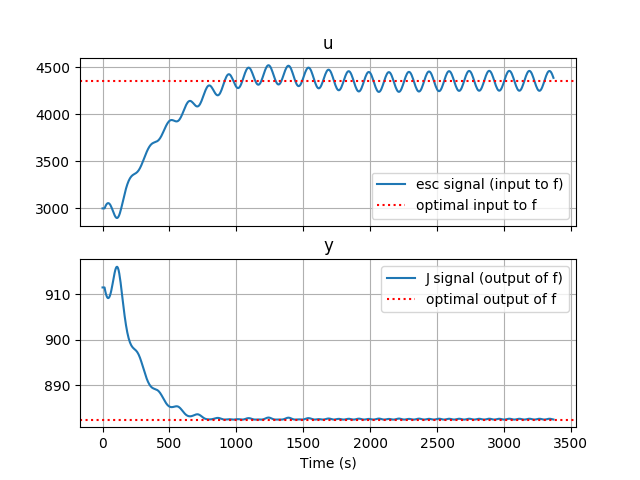

# Discrete Extreme Seeking Control for Python
## Authors
Hoang Dung Vu (Jose) - hoangdung@gmail.com <br />
Bryan Keating        - bdk44@cornell.edu

## References
The code is based on [Bryan's thesis](https://www.ideals.illinois.edu/handle/2142/97233).

## History
*Version 1.0.0* <br />
Initial commit  
Only for 1 variable function <br />
But it still can be used in multivariable scenarios by put many of ESCs in parallel mode.


## Installation
Clone the repository
```
git clone https://github.com/hoangdungt2/ESControl
cd ESControl
python setup.py
```
## Examples
Currently only one example in the 'examples' folder
```
cd examples
python Example_scalar.py
```

